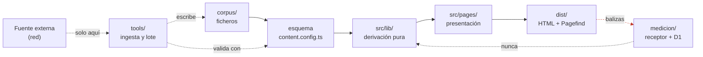
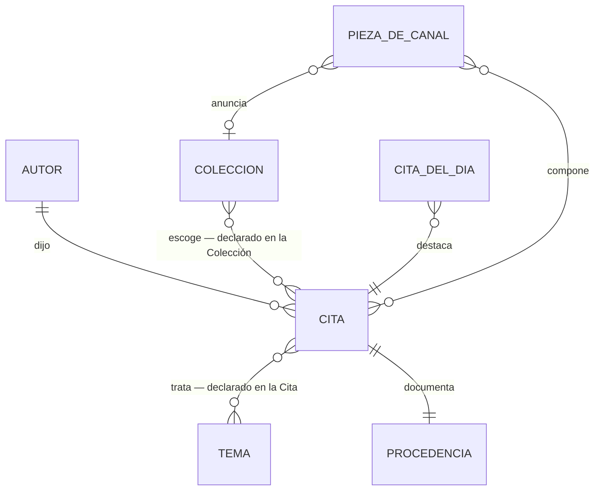

# Architecture Spine — Sabiduría de Bolsillo

## Design Paradigm

**Canalización de contenido en tiempo de build, con un plano de medición de un solo sentido.**

El Corpus es un conjunto de ficheros versionados que atraviesa una tubería de una sola dirección: *fuente → validación → derivación → prerenderizado*. No hay servidor de aplicación en el camino del visitante, ni base de datos que el sitio consulte, ni estado mutable del que dependa una página. El único almacén con escritura del que el sitio deriva algo es el repositorio git.

Junto a esa tubería corre un **segundo plano, y solo uno**: el receptor de la medición. Escribe y nunca se lee desde el sitio. Con el receptor caído, el sitio se construye y se sirve idéntico. Por eso no es una segunda fuente de verdad — es un desagüe, y AD-14 lo mantiene siéndolo.

Las etapas se corresponden con espacios de nombres:

| Etapa | Vive en | Responsabilidad |
|---|---|---|
| Recuperación | `tools/` (capa exterior) | Descarga la Fuente y versiona su documento. **La única etapa con red.** |
| Fuente | `corpus/` | Citas, Autores, Temas y Colecciones como ficheros. Verdad única. |
| Validación | `src/content.config.ts` | Esquema. La puerta de admisión. |
| Derivación | `src/lib/` | Normalización, slugs, tramos, umbrales, agregaciones. Puro. |
| Presentación | `src/pages/`, `src/components/` | HTML. Consume derivación; nunca lee `corpus/` directamente. |
| Composición del editor | `tools/` | Ingesta, auditoría y Piezas de Canal por lote. Comodidad, no puerta. |
| Medición | `medicion/` | Recibe balizas. No devuelve nada al sitio. |



**Dirección de dependencias, invariante:** `corpus → esquema → lib → pages`. Ninguna flecha vuelve. La presentación nunca lee ficheros del corpus; la derivación nunca importa componentes; el corpus no conoce nada; **la medición no alimenta a nadie**.

## Invariants & Rules

### AD-1 — La puerta de admisión vive en el esquema, no en la herramienta

- **Binds:** FR-13, FR-15, FR-27, todo `corpus/`
- **Prevents:** que una Cita añadida a mano —sin pasar por `tools/`— se publique incumpliendo el criterio de admisión. Si la puerta estuviera en el script de ingesta, editar un fichero con el editor de texto la esquivaría.
- **Rule:** el esquema de `content.config.ts` declara obligatorios `procedencia` en Cita y `añoFallecimiento` en Autor, y restringe `estadoDerechos` a `dominio-público`. Un fichero que los incumpla **rompe el build**. Ninguna comprobación de admisión puede vivir únicamente en `tools/`.

### AD-2 — Lo no publicado vive fuera del árbol construido

- **Binds:** NFR-6, FR-1, FR-4, FR-6, FR-26
- **Prevents:** que contenido `en-revisión` se filtre al sitemap, a un listado o a un feed porque alguien olvidó aplicar un filtro. Un filtro es algo que se puede olvidar en cada lugar nuevo donde se consulte el Corpus.
- **Rule:** las Citas en revisión residen en `corpus/_revision/`, directorio que la colección **no carga**. No existe un campo `publicada` que filtrar en tiempo de ejecución. Publicar es mover el fichero. La ausencia es estructural, no condicional.

### AD-3 — Una sola normalización canónica de texto

- **Binds:** FR-7, FR-8, FR-14
- **Prevents:** que la búsqueda considere iguales «café» y «cafe» mientras la detección de duplicados los considere distintos, o al revés. Dos caminos, dos criterios, resultados incoherentes que solo aparecen en producción.
- **Rule:** `src/lib/normalizar.ts` exporta una única función que quita diacríticos, pasa a minúsculas, colapsa espacios y elimina puntuación. Búsqueda, detección de duplicados y generación de slugs la consumen. Ningún módulo implementa su propia normalización.

### AD-4 — El slug de una Cita es inmutable y no deriva de su agregación

- **Binds:** FR-1, FR-6, FR-26, FR-28, NFR-4
- **Prevents:** que reasignar una Cita a otro Tema —o meterla en una Colección— cambie su URL, exactamente lo que FR-1 prohíbe, y que dos builders deriven la URL de forma distinta rompiendo enlaces entrantes.
- **Rule:** el slug se deriva de `slug-del-autor` + fragmento normalizado del texto, se escribe en el fichero al crearlo y **no se recalcula nunca**. Ni los Temas ni las Colecciones participan en ninguna ruta de Cita.

### AD-5 — La derivación es pura y no conoce la presentación

- **Binds:** todo `src/lib/`
- **Prevents:** que la lógica de agregación, umbrales y tramos quede atrapada dentro de componentes y se duplique con variantes al aparecer la segunda superficie que la necesita.
- **Rule:** los módulos de `src/lib/` son funciones puras sobre datos ya validados. No importan componentes, no leen el sistema de ficheros, no dependen de Astro — `astro:content` entra solo como `import type`, que TypeScript borra al compilar. Son verificables sin renderizar nada.

### AD-6 — Cero JavaScript por defecto; toda isla es declarada y contada

- **Binds:** NFR-2, NFR-7, FR-10, FR-7, FR-17, FR-18, FR-37
- **Prevents:** que el contenido principal acabe dependiendo de la ejecución de JavaScript, que es lo que sostiene todo el mecanismo de crecimiento del producto, y que el peso del guion crezca por acumulación sin que nadie lo decida.
- **Rule:** las páginas no envían JavaScript salvo por una isla declarada, hidratada bajo demanda. El texto de toda Cita, Autor, Tema y Colección está en el HTML inicial sin excepción. `MAX_BYTES_DE_GUION` en `src/lib/umbrales.ts` es el tope de guion en línea de una Página de Cita, y las pruebas parten de él: **subirlo es una decisión visible en un diff, y se sube cuando entra una isla a propósito, nunca porque algo engordó por su cuenta**. El `application/ld+json` de los datos estructurados no cuenta: no es JavaScript ejecutable.
- **Ratificado en la v3:** las islas son cuatro, no tres. Tres públicas —Imagen de Cita, copiar y compartir enlace— y una interna, la Imagen del Kit. El número no es la invariante; el ser declarada y contada sí. Para lo que traiga un Modelo de Ingreso, manda AD-20.

### AD-7 — La Imagen de Cita se compone en el cliente

- **Binds:** FR-10, FR-11
- **Prevents:** las dos alternativas caras — pregenerar una imagen por Cita en el build (peso y tiempo insostenibles para algo que casi nadie pide) o servirlas desde una función en servidor (rompe el despliegue puramente estático e introduce coste e infraestructura).
- **Rule:** el generador dibuja sobre canvas en el navegador, dentro de la isla, usando las mismas fuentes y tokens que la página. La descarga se produce en el cliente.
- **Ratificado en la v3:** la Tarjeta Social de FR-19 **sí** se pregenera por Cita en el build, y no es una excepción a esto: es AD-15 aplicado a un consumidor distinto. La regla general de qué se compone dónde vive en AD-15; AD-7 queda como el caso concreto de la Imagen de Cita.

### AD-8 — Una sola definición de los tramos tipográficos

- **Binds:** FR-10, FR-19, FR-21, FR-30, `DESIGN.md`, `EXPERIENCE.md § Tipografía adaptativa`
- **Prevents:** que la Página de Cita, el generador de imagen, la Tarjeta Social y las Piezas de Canal calculen el tramo por separado y unos mientan respecto a otros.
- **Rule:** `src/lib/tramos.ts` es la única fuente de la tabla de tramos por longitud, incluido el corte que oculta la acción. Toda superficie que componga texto de Cita la consume. Nadie codifica un tamaño de Cita a mano.

### AD-9 — Los umbrales son configuración con nombre

- **Binds:** FR-5, FR-6, FR-10, FR-26, FR-33, SM-C2
- **Prevents:** que un umbral viva como literal en tres sitios y una revisión futura cambie dos de ellos.
- **Rule:** `src/lib/umbrales.ts` es el único sitio donde aparece un literal numérico de regla de negocio. Hoy declara `MIN_CITAS_POR_TEMA`, `MAX_CARACTERES_IMAGEN`, `CITAS_POR_PAGINA`, `MAX_CITAS_RELACIONADAS`, `SUELO_TRADICION_LATINOAMERICANA` y `MAX_BYTES_DE_GUION`. El umbral mínimo de Colección y los Umbrales de Activación de los Modelos de Ingreso entran ahí y en ningún otro sitio.

### AD-10 — El Corpus no tiene otro almacén que git *(ADOPTADO — elección de Héctor)*

- **Binds:** FR-13…FR-16, FR-27, UJ-4, todo el despliegue
- **Prevents:** la deriva hacia un segundo origen de verdad. Con base de datos y ficheros conviviendo, la pregunta «¿cuál manda?» aparece en la primera incidencia.
- **Rule:** no hay base de datos, ni CMS, ni panel autenticado del que el sitio derive contenido. La ingesta escribe ficheros; la auditoría los lee. La historia editorial es la historia de git. El almacén de la medición no es una excepción: no contiene contenido y el sitio no lo lee (AD-14).

### AD-11 — El conjunto publicable tiene un solo dueño

- **Binds:** FR-1, FR-4, FR-6, FR-12, FR-26, NFR-1, NFR-5, NFR-6
- **Prevents:** la divergencia que AD-9 **no** cierra. Que el umbral sea una constante con nombre no dice *quién lo aplica*: quien genera las rutas de Tema y quien genera el sitemap pueden leer el mismo `MIN_CITAS_POR_TEMA` y aun así discrepar sobre un Tema de 14 Citas — página sin sitemap, o chip que enlaza a un 404.
- **Rule:** `src/lib/publicado.ts` expone las funciones que devuelven el conjunto de Citas, Autores, Temas **y Colecciones** publicables. **Toda** superficie que enumere contenido —rutas, sitemap, índice de Pagefind, chips, listados, descubrimiento, Tarjetas Sociales, Piezas de Canal— deriva de ellas. Ningún módulo aplica un umbral por su cuenta ni filtra colecciones directamente.
- **Extendido en la v3 — publicable y alcanzable son el mismo conjunto.** AD-11 fijaba *qué se publica* y nadie fijaba *qué se enlaza*, que son dos preguntas distintas: una Colección podía quedar publicada, en el sitemap y **huérfana**, incumpliendo NFR-5 y FR-26 sin que fallara nada. El mismo módulo posee ahora la enumeración de descubrimiento, de modo que una superficie no puede ser publicable y no ser alcanzable desde la portada. El agujero solo aparece al existir un tipo nuevo de agregación — por eso la v1 no lo vio.

### AD-12 — La jornada de la Cita del Día la fija el build, no el visitante

- **Binds:** FR-9, FR-29, NFR-2
- **Prevents:** la tensión real entre «cambia una vez por jornada» y un sitio prerenderizado. Sin decisión, un builder resuelve la fecha en el cliente (y mete JavaScript en la portada, contra AD-6), otro la congela en el build, y un tercero reconstruye a cada push (y la Cita del Día cambia tres veces en una tarde, contra FR-9).
- **Rule:** la selección es determinista a partir de la **fecha** del build —no del instante—, sobre el subconjunto apto para portada. El CI reconstruye una vez al día a hora fija, además de en cada push. Una fijación manual en `corpus/portada.json` para esa jornada tiene prioridad sobre la rotación.
- **Ratificado en la v3:** las fijaciones **son** el mecanismo de la composición anticipada de FR-29. El lote fija jornadas ahí; no existe un segundo calendario. Ver AD-15.

### AD-13 — La medición es un módulo propio con un vocabulario cerrado

- **Binds:** NFR-10, NFR-11, FR-8, FR-20, FR-22, SM-1…SM-10, SM-C2, SM-C4
- **Prevents:** que cada superficie llame directamente al proveedor de analítica, de modo que cambiar de proveedor obligue a tocar toda la base de código; y, peor, que se adopte un proveedor que exija banner de consentimiento y se incumpla NFR-10 sin que nadie lo decida.
- **Rule:** `src/lib/medicion.ts` es el único módulo que sabe cómo se emite un evento; ninguna página, componente ni isla habla con el transporte. El conjunto de eventos es **cerrado**: añadir uno exige modificar ese módulo, y eso es exactamente lo que debe costar. El vocabulario no se copia en el receptor, se importa del mismo módulo. Ningún evento transporta cookie, identificador, IP, agente de usuario ni referente, ni nada que pueda convertirse en uno; la unidad temporal es la jornada, no el instante.

### AD-14 — El plano de medición es de un solo sentido

- **Binds:** FR-33, LC-4, NFR-10, NFR-11, todo `medicion/`
- **Prevents:** que la medición se convierta en la segunda fuente de verdad que AD-10 existe para no tener. FR-33 dice que los Umbrales de Activación *se miden en el receptor*, y esa frase invita a que el build consulte D1 para decidir qué publica. Con eso, dos construcciones del mismo commit dejan de dar el mismo sitio y un fallo de red cambia lo que ve el visitante. La divergencia es real: una historia lo consulta desde el build y otra no, y ambas creen cumplir FR-33.
- **Rule:** **ningún byte de `dist/` deriva del plano de medición.** El sitio escribe balizas y no lee jamás de ahí, ni en build ni en cliente. Con el receptor caído, el sitio se construye y se sirve idéntico. El receptor (`medicion/receptor.ts`) decide qué se registra y no sabe dónde corre; el adaptador de plataforma es lo único sustituible. Consultar la medición se hace desde `tools/` o desde un paso de CI que **avisa**, y un aviso no es contenido.

### AD-15 — El plano de composición lo fija quién consume el artefacto

- **Binds:** FR-10, FR-19, FR-21, FR-29, FR-30, FR-31, FR-32
- **Prevents:** que cada artefacto nuevo reabra la discusión de AD-7 y se resuelva por costumbre. Con siete artefactos compuestos (Imagen, Tarjeta, Kit y las cuatro Piezas de Canal de la v3) y sin regla, uno acaba en el build por inercia —y componer 2.000 vídeos en CI es absurdo—, otro en el cliente —y meter un codificador de vídeo en el navegador también—, y el lote de FR-29 no cabe en ninguno de los dos.
- **Rule:** el plano no lo decide quién produce el artefacto, sino **dónde está quien lo consume y con qué puede contar**:
  - **Build** — lo pedirá un tercero que no ejecuta JavaScript ni pulsa nada, así que necesita una URL que ya exista. Es el caso de la Tarjeta Social (FR-19), y por eso PNG y no SVG.
  - **Cliente** — lo pide alguien con un navegador delante. Cae aquí la Imagen de Cita (FR-10) y también la Imagen del Kit (FR-21): su consumidor es el editor con el móvil (UJ-5), y la superficie tiene que seguir siendo alcanzable desde ahí.
  - **`tools/`** — composición por lote o que exige codificación, y que nadie pide a demanda. Caen aquí las cuatro Piezas de Canal de la v3 (FR-29…FR-32), incluido el motor de vídeo. Su salida **no se versiona**; lo versionado es la decisión, que es la fijación de jornada de AD-12.
- **No hay precedencia que construir entre el Kit y el lote.** FR-29 pide que el material anticipado «sustituya» al de la jornada si ambos existen, lo que invita a inventar un desempate. No hace falta: los dos derivan de la **misma** fijación de `corpus/portada.json`, así que componen lo mismo. El empate es imposible por construcción.

### AD-16 — La pregeneración por Cita es función del contenido, no del calendario

- **Binds:** FR-19, NFR-7, §6.4 del PRD, SM-C1
- **Prevents:** que el crecimiento del Corpus —que es el objetivo declarado de la v3— convierta el build en un cuello de botella sin que nadie lo vea venir. Hoy se rasterizan 38 Tarjetas; a las ~2.000 Citas de §6.1 son unas 53 veces la misma faena, en cada construcción, y hay al menos dos al día (push y reconstrucción de AD-12). La divergencia que cierra mira hacia adelante: sin esta regla, la v3 puede añadir un segundo artefacto por Cita que se reconstruya entero cada día, y el coste se dobla sin que aparezca en ninguna revisión.
- **Rule:** **una construcción no rasteriza un artefacto por Cita cuya entrada no ha cambiado.** La regla vincula a la clase entera —todo artefacto pregenerado por Cita, no solo la Tarjeta—, y la entrada incluye la versión de la plantilla, para que un cambio de diseño sí lo regenere todo. El mecanismo concreto de caché lo elige el código.

### AD-17 — El carácter publicable de una superficie tiene un solo dueño

- **Binds:** NFR-1, NFR-5, NFR-6, NFR-8, NFR-9, FR-21, FR-26, FR-29
- **Prevents:** que una superficie interna acabe indexada por olvido, y que una superficie pública nueva se quede fuera del barrido de calidad. Hoy el `noindex` se declara en la página y la exclusión del sitemap en una lista de expresiones regulares mantenida a mano en `astro.config.mjs`: dos sitios que recordar, y el fallo es silencioso —la superficie se anuncia, nadie recibe un error, y se descubre semanas después en Search Console—. Es el filtro-que-se-olvida de AD-2, aplicado a superficies en vez de a contenido. La v3 añade una de cada: el lote interno de FR-29 y la Página de Colección pública.
- **Rule:** una superficie declara **en un solo sitio** si es publicable, y todo lo demás **deriva** de esa declaración en vez de mantener su propia lista: la inclusión en el sitemap, el `noindex`, y el barrido automatizado de accesibilidad y móvil que exigen NFR-8 y NFR-9 sobre las superficies públicas. Un dueño, tres consecuencias. Añadir una superficie no puede requerir acordarse de un segundo fichero — ni para ocultarla, ni para someterla a las mismas pruebas que las demás.

### AD-18 — La pertenencia a una Colección se declara en la Colección, y es blanda

- **Binds:** FR-26, FR-27, FR-28
- **Prevents:** dos divergencias distintas. La primera, que la Colección copie el patrón del Tema —que hoy se declara *en la Cita*, en su frontmatter— y crear una Colección obligue a editar decenas de ficheros de Cita, contra FR-27. La segunda, más grave: que la lista de miembros sea una referencia dura del esquema, con lo que **mover una Cita a `corpus/_revision/` rompería el build**, y AD-2 exige que despublicar siga siendo mover un fichero.
- **Rule:** la Colección declara sus miembros por slug en su propio fichero, invirtiendo a propósito la dirección del Tema. La lista es una referencia **blanda**: `publicado.ts` la resuelve intersectándola con el conjunto publicable, y un slug que no esté publicado simplemente no forma parte de la Colección. El umbral mínimo se aplica al recuento **resuelto**, nunca al declarado. Así, retirar una Cita la retira de todas sus Colecciones sin hueco ni enlace roto (FR-26), y una Colección que cae por debajo de su umbral se despublica sola con todas las superficies de acuerdo.

### AD-19 — Ninguna agregación reproduce la Cita

- **Binds:** NFR-13, FR-28, FR-6, FR-5
- **Prevents:** que multiplicar superficies de agregación reparta la señal en lugar de sumarla. Con dos agregaciones transversales —Tema y Colección— más los listados de Autor, el mismo texto puede acabar indexable en cuatro URL, y entonces la Colección no captura cola larga: canibaliza a la Cita que debía alimentar.
- **Rule:** toda **superficie indexable del sitio** que enumere Citas las presenta a través del **mismo componente de tarjeta**, que muestra fragmento acotado, atribución y enlace. Ninguna agregación reproduce el texto íntegro de una Cita ni declara una canónica distinta de la Página de Cita. La Colección reutiliza ese componente; no compone el suyo.
- **Alcance, para que no bloquee FR-30:** esto vincula a superficies indexables, no a material de salida. Una Pieza de Canal reúne Citas íntegras a propósito y no es una superficie: NFR-13 habla de canibalización en buscadores, y una imagen publicada en una cuenta no compite por la canónica de nada.

### AD-20 — Ningún guion de tercero, y el Modelo de Ingreso no es una excepción

- **Binds:** FR-34, FR-35, FR-37, NFR-7, NFR-10, NFR-11, §11 del PRD
- **Prevents:** que la monetización entre por la única puerta que el producto no tiene cerrada. AD-6 fija el tope de guion pero no dice nada de terceros, y un Modelo de Ingreso llega con el guion del proveedor bajo el brazo: cumple el tope de la página propia y aun así carga 300 KB ajenos, cookies incluidas, incumpliendo NFR-11 sin que nadie lo haya decidido.
- **Rule:** ninguna superficie carga guion de tercero, y `MAX_BYTES_DE_GUION` cubre también lo que traiga un Modelo de Ingreso. La propiedad se garantiza **por construcción, no por la casilla de configuración del proveedor** — el mismo criterio con el que AD-13 resolvió la medición. Consecuencia deliberada: un proveedor que exija su propio guion en la página **no cumple FR-37 y no se enciende**, por rentable que sea.
- **Qué superficie admite qué Modelo tiene su propio dueño**, declarado junto al estado de encendido de AD-21, y **el armazón compartido no aloja ningún Modelo**. No se delega en AD-11: el conjunto publicable es dueño del *contenido* que se enumera, no de qué superficie puede alojar un ingreso, y confundirlos deja la invitación de donación en el armazón común — es decir, en la Página de Cita, que es lo primero que FR-34 prohíbe.

### AD-21 — Encender un Modelo de Ingreso es un commit, no una medición

- **Binds:** FR-33, FR-34, FR-35, FR-36, FR-37, SM-C4, §12.1 del PRD
- **Prevents:** que la activación ocurra en vez de decidirse. Si el umbral se comprueba automáticamente, el Modelo se enciende solo — y entonces no sabe apagarse: §12.1 exige apagarlo si SM-C4 se degrada, y un disparador por umbral mide el ingreso pero no el daño. Cierra además la divergencia de dónde vive el estado encendido/apagado, que sin decisión acaba en tres sitios.
- **Rule:** el estado de cada Modelo de Ingreso es configuración **versionada en el repositorio**, y encender o apagar uno es un cambio visible en un diff, reversible por revert y registrado en la historia de git. Una herramienta de `tools/` consulta el receptor e **informa** de si el umbral está cruzado —informa la decisión del editor, no la sustituye, como `salud.ts` y `huecos.ts`—, y un paso del flujo diario de CI avisa cuando se cruza, para que no dependa de acordarse. Un Modelo apagado no reserva hueco ni deja espacio en blanco: es invisible, no latente.

### AD-22 — La red vive en la cáscara de `tools/`, y en ningún otro sitio

- **Binds:** FR-23, todo `tools/`, `src/lib/`, `src/content.config.ts`, el build
- **Prevents:** que la primera dependencia de red del proyecto —la recuperación de la Fuente que FR-23 exige— se filtre hacia dentro. Sin regla, un ayudante de `src/lib/` acaba resolviendo una URL «por comodidad» y una construcción pasa a depender de que un servidor ajeno esté vivo y diga hoy lo mismo que ayer. Es la misma propiedad de reproducibilidad que AD-14 protege para la medición, ahora amenazada por el otro extremo de la tubería.
- **Rule:** solo la capa exterior de `tools/` hace peticiones de red. `tools/lib/`, `src/lib/`, el esquema y las páginas son puros sobre datos **ya recuperados**, y **ningún paso del build descarga nada**. Ratifica lo que el código ya cumple: `tools/lib/extraccion.ts` se declara «puro y sin red», y la descarga vive en `tools/extraer.ts`, una capa fina encima.

### AD-23 — El cotejo corre en el build, contra el documento versionado

- **Binds:** FR-23, FR-24, AD-1, AD-2, AD-10, SM-C1
- **Prevents:** la única vía por la que el sembrado ejecutado por agentes puede destruir lo único que el producto tiene. AD-1 comprueba que la Procedencia **exista**, no que sea **cierta**, y a volumen esa diferencia deja de ser teórica: una obra plausible y un año plausible pasan la puerta igual que los verdaderos. Si el cotejo viviera solo en `tools/`, un fichero escrito a mano lo esquivaría — exactamente el fallo que AD-1 existe para cerrar.
- **Rule:** el documento de la Fuente se versiona en `corpus/fuentes/`, que **no es una colección** y sí lo lee el build — carácter propio, distinto tanto de `corpus/citas/` como de `corpus/semilla/`, cuyo registro sigue siendo puramente auditable e invisible al build. Cada Cita referencia su documento, y **el cotejo corre en el build sin que ningún camino lo esquive**: una Cita cuyo texto no se localice literalmente en su documento **rompe el build**, con la ruta del fichero y la regla incumplida. Cuatro precisiones que la regla fija porque sin ellas dos builders divergen:
  - **Dónde corre el cotejo lo elige el código**, con una condición: fuera de `src/lib/`, que por AD-5 no lee el sistema de ficheros. Cargador, refinamiento del esquema o paso de validación propio son todos válidos; lo invariante es que corra en el build y no se pueda saltar. AD-1 nunca exigió que la puerta fuera el esquema — exigió que no viviera solo en `tools/` y que un fichero escrito a mano no la esquivara.
  - **Un documento por par (Fuente, obra).** Recuperar una obra ya presente reutiliza su documento en vez de añadir otra copia, y el documento se nombra `{id-de-fuente}--{slug-de-obra}`; la Cita lo referencia por ese mismo identificador. Sin esto, dos sesiones de sembrado dejan dos copias y esquemas de referencia incompatibles.
  - El documento se versiona como **texto plano**, con el marcado retirado al recuperarlo. Guardar el HTML de origen en un caso y el texto extraído en otro hace que el mismo cotejo pase contra uno y falle contra el otro.
  - El cotejo compara **colapsando espacios y nada más**. No pasa por `normalizar.ts`: quitar diacríticos haría coincidir «cafe» con «café», y una Cita que difiere en un acento de su edición es justo el defecto que NFR-12 y SM-C1 quieren cazar.

## Consistency Conventions

| Concern | Convention |
|---|---|
| Nombres de entidades | Español, en singular, exactamente como el glosario del PRD: `Cita`, `Autor`, `Tema`, `Procedencia`, `Colección`, `Pieza de Canal`, `Modelo de Ingreso`. Ni `quote`, ni `frase`, ni `author`. Los identificadores de código siguen el glosario. |
| Ficheros del corpus | `corpus/citas/{slug-autor}--{fragmento}.md` · `corpus/autores/{slug-autor}.yml` · `corpus/temas/{slug-tema}.yml` · `corpus/colecciones/{slug-coleccion}.yml`. En revisión: `corpus/_revision/`. Documentos de Fuente: `corpus/fuentes/{id-de-fuente}--{slug-de-obra}.txt`. |
| Rutas públicas | `/cita/{slug}` · `/autor/{slug}` · `/tema/{slug}` · `/coleccion/{slug}` · `/buscar`. En español, minúsculas, sin diacríticos, sin identificadores opacos (NFR-4). |
| Fechas y años | El año de fallecimiento es un entero. Las fechas completas y las jornadas, ISO 8601. |
| Ausencia de datos | Un campo opcional ausente se omite del fichero; **nunca** cadena vacía ni `null`. La distinción entre Procedencia completa, parcial y ausente es de presencia de campos, no de valores centinela. |
| Errores de contenido | Un fallo de validación es un fallo de build con la ruta del fichero y la regla incumplida (FR-13). No se degrada a aviso. |
| Estilos | Tokens de `DESIGN.md` como propiedades personalizadas de CSS, definidas una vez. Ningún valor de color o tipografía en un componente. |
| Tokens serif | La familia serif se aplica exclusivamente a texto de Cita, nombre de Autor, nombre de Tema y nombre de Colección. Cualquier otro uso es un error. |
| Conjuntos cerrados | Eventos de medición, destinos de compartición, redes de origen y Modelos de Ingreso son conjuntos cerrados con nombre. Ampliarlos exige tocar su módulo, y ese coste es deliberado. |

## Stack

Ratificado el 2026-08-17 **desde `package.json`**, aplicando lo que esta espina prescribió en la v1: el código es el dueño en cuanto existe. La v3 no introduce tecnología nueva.

| Name | Version |
|---|---|
| Astro | ^7.2.0 |
| Node.js | >=22.12.0 |
| TypeScript | ^5.9.0, modo estricto |
| Zod (vía `astro/zod`) | la que fija Astro 7 |
| Pagefind | ^1.5.2 |
| `@astrojs/sitemap` | ^3.7.3 |
| `sharp` (Tarjeta Social) | ^0.35.3 |
| Vitest · Playwright · axe | ^4.1.10 · ^1.62.1 · ^4.12.1 |
| Source Serif 4 · Inter | vía Fonts API de Astro |
| Hosting del sitio | GitHub Pages, estático, publicado por Actions |
| Receptor de medición | Cloudflare Workers + D1 |
| Motor de vídeo (FR-31) | **sin elegir, a propósito** — ver *Deferred* |

## Structural Seed

```text
sabiduria-de-bolsillo/
  corpus/
    citas/           # una Cita por fichero — la verdad
    autores/
    temas/
    colecciones/     # AD-18: la Colección declara sus miembros, en blando
    portada.json     # AD-12: fijaciones de jornada; también las del lote (FR-29)
    fuentes/         # AD-23: documentos de Fuente. Los lee el build; NO es colección
    semilla/         # registro auditable de la siembra inicial; el build no lo lee
    _revision/       # AD-2: el build NO carga este directorio
  src/
    content.config.ts  # AD-1: la puerta de admisión
    lib/               # AD-5: derivación pura
      publicado.ts     # AD-11: dueño único del conjunto publicable
      umbrales.ts      # AD-9: todo literal de regla de negocio
      medicion.ts      # AD-13: único emisor, vocabulario cerrado
      citaDelDia.ts    # AD-12
      normalizar.ts · slug.ts · tramos.ts · atribucion.ts · tarjeta.ts · kit.ts
      destinos.ts · redes.ts · compartir.ts · dominio.ts · marca.ts · salud.ts · huecos.ts
    components/        # AD-19: la tarjeta de listado, única para toda agregación
    islands/           # AD-6: declaradas y contadas
    pages/
      cita/[slug].astro · autor/[slug]/[...page].astro · tema/[slug]/[...page].astro
      coleccion/[slug]/[...page].astro     # v3
      tarjeta/[slug].png.ts                # AD-15 build · AD-16 incremental
      buscar.astro · index.astro · 404.astro · robots.txt.ts
      kit.astro                            # AD-17: interna
  tools/               # AD-15: composición del editor. Ingesta, auditoría y lote
  medicion/            # AD-14: escribe y no se lee. receptor.ts + adaptador + esquema.sql
```



**Entorno operativo.** Dos artefactos desplegables y ningún entorno de ensayo. El sitio es una carpeta de HTML publicada en GitHub Pages por Actions, con doble disparador: cada push a la rama principal y una reconstrucción programada diaria (AD-12). El receptor de medición se despliega **por separado** y con su propio ciclo — es la propiedad que AD-14 protege: un cambio en uno no obliga a redesplegar el otro. No hay staging porque no hay estado que migrar; la reversión es volver a desplegar un commit anterior, y la copia de seguridad es el repositorio. El dominio propio se declara en `public/CNAME`, del que `src/lib/dominio.ts` deriva canónicas y sitemap.

## Capability → Architecture Map

| Capacidad | Vive en | Gobernada por |
|---|---|---|
| FR-1…FR-3 Página de Cita | `pages/cita/[slug].astro` | AD-4, AD-6, AD-8 |
| FR-4, FR-5 Página de Autor | `pages/autor/[slug]/` | AD-9, AD-19 |
| FR-6 Página de Tema | `pages/tema/[slug]/` | AD-9, AD-11, AD-19 |
| FR-7, FR-8 Búsqueda | Pagefind + isla | AD-3, AD-6, AD-11 |
| FR-9 Cita del Día | `lib/citaDelDia.ts` + `index.astro` | AD-5, AD-12 |
| FR-10, FR-11 Imagen de Cita | `islands/` | AD-7, AD-8, AD-15 |
| FR-12 Descubrimiento | `lib/` agregaciones | AD-5 |
| FR-13…FR-16 Ingesta y curación | `tools/` + `content.config.ts` | AD-1, AD-2, AD-3, AD-10 |
| FR-17, FR-18, FR-20 Compartición | `islands/` + `lib/compartir.ts` | AD-6, AD-13 |
| FR-19 Tarjeta Social | `pages/tarjeta/[slug].png.ts` | **AD-15**, **AD-16**, AD-11 |
| FR-21, FR-22 Kit Diario | `kit.astro` + `lib/kit.ts` | AD-15, **AD-17**, AD-12 |
| FR-23…FR-25 Sembrado | `tools/` + `content.config.ts` | **AD-22**, **AD-23**, AD-1, AD-10 |
| **FR-26…FR-28 Colecciones** | `corpus/colecciones/` + `pages/coleccion/` | **AD-18**, **AD-19**, AD-11, AD-4 |
| **FR-29…FR-32 Piezas de Canal** | `tools/` | **AD-15**, AD-12, AD-8 |
| **FR-33…FR-37 Modelos de Ingreso** | configuración versionada + `tools/` | **AD-21**, **AD-20**, **AD-14**, AD-9 |
| NFR-1…NFR-6 SEO | build + `pages/` | AD-2, AD-6, AD-11, **AD-17** |
| **NFR-13 No canibalización** | componente de tarjeta único | **AD-19** |
| LC-4 Medición | `medicion/` | **AD-14**, AD-13 |

## Deferred

- **Motor de vídeo (FR-31).** Sin encoder elegido, y es deliberado: su propia puerta —ninguna cuenta de imagen fija demostrando visitas, ningún motor— hace que elegirlo hoy sea vincular una versión que caducará antes de usarse. Lo que **sí** queda decidido es dónde vive (AD-15: `tools/`), y por eso se recorta sin tocar nada más. Se decide cuando SM-8 dé señal.
- **Umbral mínimo de Colección.** El PRD lo deja abierto a propósito (§14.4) y se fija curando las tres o cuatro primeras. AD-9 dice dónde vivirá el número; AD-18 dice sobre qué recuento se aplica. Nada más se decide aquí.
- **Mecanismo de caché de la pregeneración por Cita.** AD-16 fija la invariante; el cómo —clave por hash de contenido, caché de CI, o artefacto reutilizado— lo elige el código cuando el build lo pida. Restricción conocida que conviene no descubrir sola: a ~2.000 Citas la caché es del orden de cientos de MB, y las de CI tienen tope por repositorio y se desalojan por desuso. La reconstrucción diaria de AD-12 juega a favor —se usa cada día, así que no caduca—; el tamaño no.
- **Mecanismo de caché del cotejo (AD-23).** La invariante es que el esquema recoteje; a ~2.000 Citas contra decenas de MB de texto, dos veces al día por AD-12, conviene no rehacerlo entero cada vez. Es el mismo problema que AD-16 resolvió para la pregeneración por Cita —función del contenido, no del calendario— y admite la misma solución. El cómo lo elige el código cuando el build lo pida.
- **Proveedor concreto de analítica y de publicidad.** AD-13 y AD-20 fijan las propiedades que deben cumplir; qué se contrata se decide al cruzar el umbral. AD-20 ya excluye buena parte del mercado de display, y conviene saberlo antes de evaluar.
- **Definición del producto propio (FR-36).** Deuda deliberada del PRD: elegir entre lámina, antología y recurrencia sin saber quién visita el sitio es el supuesto que §12 existe para evitar.
- **Estrategia de crecimiento del build.** AD-16 quita el coste que crecía con el Corpus. Lo que queda —el prerenderizado completo— se revisa si el build supera los cinco minutos con la caché ya puesta, no antes.
- **Interfaz web para la curación.** La elección de ficheros en el repo mantiene UJ-4 en terminal. Si la ingesta se vuelve el cuello de botella, vuelve a la mesa AD-10.
- **Internacionalización.** Fuera del producto; ninguna decisión de esta espina la bloquea.
- **Multiusuario y permisos.** No existe autenticación en producción. Si aparecen más editores, el mecanismo es el control de acceso del repositorio, no un sistema de cuentas.
