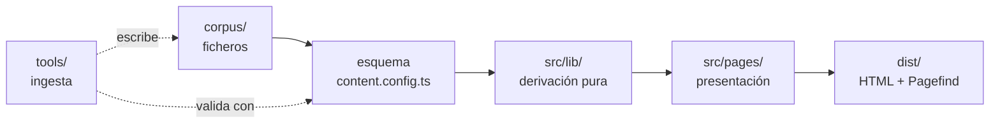
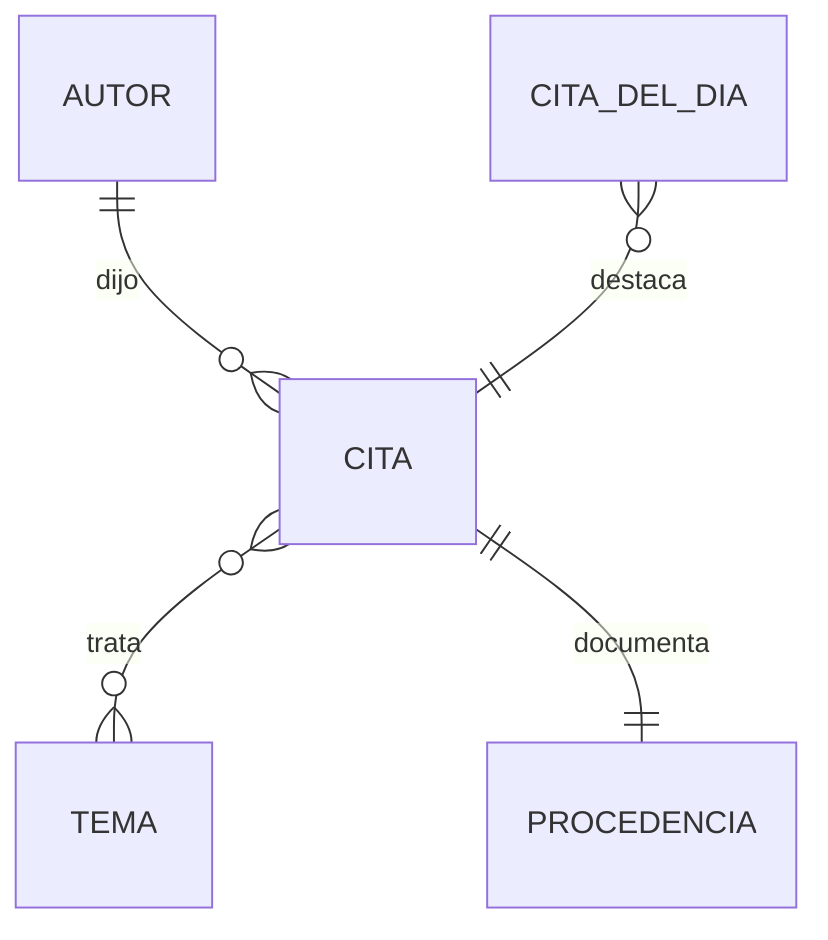

# Architecture Spine — Sabiduría Diaria

## Design Paradigm

**Canalización de contenido en tiempo de build.** El Corpus es un conjunto de ficheros versionados que atraviesa una tubería de una sola dirección: *fuente → validación → derivación → prerenderizado*. No hay servidor de aplicación, ni base de datos, ni estado mutable en producción. El único almacén con escritura es el repositorio git.

Las etapas se corresponden con espacios de nombres:

| Etapa | Vive en | Responsabilidad |
|---|---|---|
| Fuente | `corpus/` | Citas y Autores como ficheros. Verdad única. |
| Validación | `src/content.config.ts` | Esquema. La puerta de admisión. |
| Derivación | `src/lib/` | Normalización, slugs, tramos, umbrales, agregaciones. Puro. |
| Presentación | `src/pages/`, `src/components/` | HTML. Consume derivación; nunca lee `corpus/` directamente. |
| Herramientas | `tools/` | Ingesta y auditoría. Comodidad, no puerta. |



**Dirección de dependencias, invariante:** `corpus → esquema → lib → pages`. Ninguna flecha vuelve. La presentación nunca lee ficheros del corpus; la derivación nunca importa componentes; el corpus no conoce nada.

## Invariants & Rules

### AD-1 — La puerta de admisión vive en el esquema, no en la herramienta

- **Binds:** FR-13, FR-15, todo `corpus/`
- **Prevents:** que una Cita añadida a mano —sin pasar por `tools/`— se publique incumpliendo el criterio de admisión. Si la puerta estuviera en el script de ingesta, editar un fichero con el editor de texto la esquivaría.
- **Rule:** el esquema de `content.config.ts` declara obligatorios `procedencia` en Cita y `añoFallecimiento` en Autor, y restringe `estadoDerechos` a `dominio-público`. Un fichero que los incumpla **rompe el build**. Ninguna comprobación de admisión puede vivir únicamente en `tools/`.

### AD-2 — Lo no publicado vive fuera del árbol construido

- **Binds:** NFR-6, FR-1, FR-4, FR-6
- **Prevents:** que contenido `en-revisión` se filtre al sitemap, a un listado o a un feed porque alguien olvidó aplicar un filtro. Un filtro es algo que se puede olvidar en cada lugar nuevo donde se consulte el Corpus.
- **Rule:** las Citas en revisión residen en `corpus/_revision/`, directorio que la colección **no carga**. No existe un campo `publicada` que filtrar en tiempo de ejecución. Publicar es mover el fichero. La ausencia es estructural, no condicional.

### AD-3 — Una sola normalización canónica de texto

- **Binds:** FR-7, FR-8, FR-14
- **Prevents:** que la búsqueda considere iguales «café» y «cafe» mientras la detección de duplicados los considere distintos, o al revés. Dos caminos, dos criterios, resultados incoherentes que solo aparecen en producción.
- **Rule:** `src/lib/normalizar.ts` exporta una única función que quita diacríticos, pasa a minúsculas, colapsa espacios y elimina puntuación. Búsqueda, detección de duplicados y generación de slugs la consumen. Ningún módulo implementa su propia normalización.

### AD-4 — El slug de una Cita es inmutable y no deriva del Tema

- **Binds:** FR-1, FR-6, NFR-4
- **Prevents:** que reasignar una Cita a otro Tema cambie su URL — exactamente lo que FR-1 prohíbe — y que dos builders deriven la URL de forma distinta rompiendo enlaces entrantes.
- **Rule:** el slug se deriva de `slug-del-autor` + fragmento normalizado del texto, se escribe en el fichero al crearlo y **no se recalcula nunca**. Los Temas no participan en ninguna ruta de Cita.

### AD-5 — La derivación es pura y no conoce la presentación

- **Binds:** todo `src/lib/`
- **Prevents:** que la lógica de agregación, umbrales y tramos quede atrapada dentro de componentes y se duplique con variantes al aparecer la segunda superficie que la necesita.
- **Rule:** los módulos de `src/lib/` son funciones puras sobre datos ya validados. No importan componentes, no leen el sistema de ficheros, no dependen de Astro. Son verificables sin renderizar nada.

### AD-6 — Cero JavaScript por defecto; toda interactividad es una isla declarada

- **Binds:** NFR-2, NFR-7, FR-10, FR-7
- **Prevents:** que el contenido principal acabe dependiendo de la ejecución de JavaScript, que es lo que sostiene todo el mecanismo de crecimiento del producto.
- **Rule:** las páginas no envían JavaScript. Solo tres islas existen, cada una hidratada bajo demanda: el generador de Imagen de Cita (al pulsar), la búsqueda (al enfocar) y el botón de copiar. El texto de toda Cita, Autor y Tema está en el HTML inicial sin excepción.

### AD-7 — La Imagen de Cita se genera en el cliente

- **Binds:** FR-10, FR-11
- **Prevents:** las dos alternativas caras — pregenerar ~6.000 imágenes en el build (peso y tiempo insostenibles) o servirlas desde una función en servidor (rompe el despliegue puramente estático e introduce coste e infraestructura).
- **Rule:** el generador dibuja sobre canvas en el navegador, dentro de la isla, usando las mismas fuentes y tokens que la página. La descarga se produce en el cliente. Ningún artefacto de imagen se versiona ni se sirve desde el origen.

### AD-8 — Una sola definición de los tramos tipográficos

- **Binds:** FR-10, `DESIGN.md`, `EXPERIENCE.md § Tipografía adaptativa`
- **Prevents:** que la Página de Cita y el generador de imagen calculen el tramo por separado y la previsualización mienta respecto al fichero que el visitante descarga.
- **Rule:** `src/lib/tramos.ts` es la única fuente de la tabla de tramos por longitud, incluido el corte en 300 caracteres que oculta la acción. La página y el generador la consumen. Nadie codifica un tamaño de Cita a mano.

### AD-9 — Los umbrales son configuración con nombre

- **Binds:** FR-5, FR-6, FR-10, SM-C2
- **Prevents:** que un umbral viva como literal en tres sitios y una revisión futura cambie dos de ellos.
- **Rule:** `src/lib/umbrales.ts` declara `MIN_CITAS_POR_TEMA = 15`, `MAX_CARACTERES_IMAGEN = 300`, `CITAS_POR_PAGINA = 50`. Ningún literal numérico de regla de negocio aparece fuera de ese módulo.

### AD-10 — El Corpus no tiene otro almacén que git *(ADOPTADO — elección de Héctor)*

- **Binds:** FR-13…FR-16, UJ-4, todo el despliegue
- **Prevents:** la deriva hacia un segundo origen de verdad. Con base de datos y ficheros conviviendo, la pregunta «¿cuál manda?» aparece en la primera incidencia.
- **Rule:** no hay base de datos, ni CMS, ni panel autenticado en producción. La ingesta escribe ficheros; la auditoría de FR-16 los lee. La historia editorial es la historia de git.

### AD-11 — El conjunto publicable tiene un solo dueño

- **Binds:** FR-1, FR-4, FR-6, NFR-1, NFR-5, NFR-6
- **Prevents:** la divergencia que AD-9 **no** cierra. Que el umbral sea una constante con nombre no dice *quién lo aplica*: quien genera las rutas de Tema y quien genera el sitemap pueden leer el mismo `MIN_CITAS_POR_TEMA` y aun así discrepar sobre un Tema de 14 Citas — página sin sitemap, o chip que enlaza a un 404. Lo mismo entre el índice de búsqueda, los chips de Tema y los enlaces de descubrimiento.
- **Rule:** `src/lib/publicado.ts` expone las funciones que devuelven el conjunto de Citas, Autores y Temas publicables. **Toda** superficie que enumere contenido —rutas, sitemap, índice de Pagefind, chips, listados, descubrimiento— deriva de ellas. Ningún módulo aplica un umbral por su cuenta ni filtra colecciones directamente.

### AD-12 — La jornada de la Cita del Día la fija el build, no el visitante

- **Binds:** FR-9, NFR-2
- **Prevents:** la tensión real entre «cambia una vez por jornada» y un sitio prerenderizado. Sin decisión, un builder resuelve la fecha en el cliente (y mete JavaScript en la portada, contra AD-6), otro la congela en el build (y la portada se queda estancada), y un tercero reconstruye a cada push (y la Cita del Día cambia tres veces en una tarde, contra FR-9).
- **Rule:** la selección es determinista a partir de la fecha del build, sobre el subconjunto marcado como apto para portada. El CI reconstruye **una vez al día a hora fija**, además de en cada push. Un despliegue por push conserva la Cita del Día de la jornada en curso: la fecha efectiva se lee de la última reconstrucción programada, no del momento del push.

### AD-13 — La medición es un módulo propio con un vocabulario cerrado

- **Binds:** NFR-10, NFR-11, FR-8, SM-1…SM-6, SM-C2
- **Prevents:** dos divergencias distintas. Primera: que cada superficie llame directamente al proveedor de analítica, de modo que cambiar de proveedor —o cumplir NFR-11— obligue a tocar toda la base de código. Segunda, y peor: que se adopte un proveedor que exija banner de consentimiento, incumpliendo NFR-10 sin que nadie lo decida conscientemente. Esta decisión estuvo diferida bajo el supuesto de que «no condiciona ninguna otra»; era falso — condiciona FR-8, que no tiene dónde registrar una consulta sin ella.
- **Rule:** `src/lib/medicion.ts` es el único módulo que emite eventos; ninguna página, componente ni isla llama al proveedor directamente. El conjunto de eventos es cerrado y con nombre: vista de Página de Cita, copiado, descarga de imagen y búsqueda sin resultados. El proveedor debe funcionar **sin cookies y sin identificación individual del visitante**, para que NFR-10 y NFR-11 se cumplan por elección de herramienta y no por configuración. Ningún evento transporta datos personales; la consulta de búsqueda viaja como texto de la consulta, nunca asociada a un visitante.

## Consistency Conventions

| Concern | Convention |
|---|---|
| Nombres de entidades | Español, en singular, exactamente como el glosario del PRD: `Cita`, `Autor`, `Tema`, `Procedencia`. Ni `quote`, ni `frase`, ni `author`. Los identificadores de código siguen el glosario. |
| Ficheros del corpus | `corpus/citas/{slug-autor}--{fragmento}.md` · `corpus/autores/{slug-autor}.yml` · `corpus/temas/{slug-tema}.yml`. En revisión: `corpus/_revision/`. |
| Rutas públicas | `/cita/{slug}` · `/autor/{slug}` · `/tema/{slug}` · `/buscar`. En español, minúsculas, sin diacríticos, sin identificadores opacos (NFR-4). |
| Fechas y años | El año de fallecimiento es un entero. Las fechas completas, ISO 8601. |
| Ausencia de datos | Un campo opcional ausente se omite del fichero; **nunca** cadena vacía ni `null`. La distinción entre Procedencia completa, parcial y ausente es de presencia de campos, no de valores centinela. |
| Errores de contenido | Un fallo de validación es un fallo de build con la ruta del fichero y la regla incumplida (FR-13). No se degrada a aviso. |
| Estilos | Tokens de `DESIGN.md` como propiedades personalizadas de CSS, definidas una vez. Ningún valor de color o tipografía en un componente. |
| Tokens serif | La familia serif se aplica exclusivamente a texto de Cita, nombre de Autor y nombre de Tema. Cualquier otro uso es un error. |

## Stack

Verificado el 2026-08-10. El código pasa a ser el dueño en cuanto exista.

| Name | Version |
|---|---|
| Astro | 7.0 |
| Node.js | 22 LTS (mínimo exigido por Astro 7) |
| TypeScript | modo estricto |
| Zod (vía `astro/zod`) | la que fija Astro 7 |
| Pagefind | 1.5 |
| Source Serif 4 · Inter | vía Fonts API de Astro |
| Hosting | estático con build en CI al hacer push |

## Structural Seed

```text
sabiduria-diaria/
  corpus/
    citas/           # una Cita por fichero — la verdad
    autores/
    temas/
    _revision/       # AD-2: el build NO carga este directorio
  src/
    content.config.ts  # AD-1: la puerta de admisión
    lib/               # AD-5: derivación pura
      normalizar.ts    # AD-3
      slug.ts          # AD-4
      tramos.ts        # AD-8
      umbrales.ts      # AD-9
      publicado.ts     # AD-11: dueño único del conjunto publicable
    components/
    islands/           # AD-6: las tres únicas islas
    pages/
      cita/[slug].astro
      autor/[slug].astro
      tema/[slug].astro
      buscar.astro
      index.astro
    styles/            # tokens de DESIGN.md
  tools/               # ingesta y auditoría — comodidad, no puerta
```



**Entorno operativo.** Un solo entorno: producción. El desarrollo es local (`astro dev`). No hay staging porque no hay estado que migrar ni integraciones que ensayar — el artefacto desplegado es una carpeta de HTML. Cada push a la rama principal reconstruye y publica. La reversión es volver a desplegar un commit anterior. Copia de seguridad = el repositorio.

## Capability → Architecture Map

| Capacidad | Vive en | Gobernada por |
|---|---|---|
| FR-1…FR-3 Página de Cita | `pages/cita/[slug].astro` | AD-4, AD-6, AD-8 |
| FR-4, FR-5 Página de Autor | `pages/autor/[slug].astro` | AD-9 |
| FR-6 Página de Tema | `pages/tema/[slug].astro` | AD-9, **AD-11** |
| FR-7, FR-8 Búsqueda | Pagefind + isla | AD-3, AD-6, AD-11 |
| FR-9 Cita del Día | `lib/` + `index.astro` | AD-5, **AD-12** |
| FR-10, FR-11 Imagen de Cita | `islands/` | AD-7, AD-8 |
| FR-12 Descubrimiento | `lib/` agregaciones | AD-5 |
| FR-13…FR-16 Ingesta y curación | `tools/` + `content.config.ts` | **AD-1**, AD-2, AD-3, AD-10 |
| NFR-1…NFR-6 SEO | build + `pages/` | AD-2, AD-6, **AD-11** |

## Deferred

- **Generación de Imagen en servidor.** Si la fidelidad del canvas en el cliente resulta insuficiente al probar plantillas reales, la salida es una función en el borde con caché. Se decide con plantillas en la mano, no antes.
- **Estrategia de crecimiento del build.** A partir de ~20.000 Citas el prerenderizado completo deja de ser cómodo. La v1 apunta a 2.000. Se revisa cuando el build supere los cinco minutos, no antes.
- **Interfaz web para la curación.** La elección de ficheros en el repo hace que UJ-4 se resuelva en terminal. Si la ingesta se vuelve el cuello de botella, se reconsidera — y entonces vuelve a la mesa AD-10.
- **Internacionalización.** Fuera del producto; ninguna decisión de esta espina la bloquea.
- **Proveedor concreto de analítica.** AD-13 fija las propiedades que debe cumplir y la forma de consumirla; qué producto se contrata se decide al desplegar. *(La analítica en sí dejó de estar diferida: ver AD-13.)*
- **Multiusuario y permisos.** No existe autenticación en producción. Si aparecen más editores, el mecanismo es el control de acceso del repositorio, no un sistema de cuentas.
